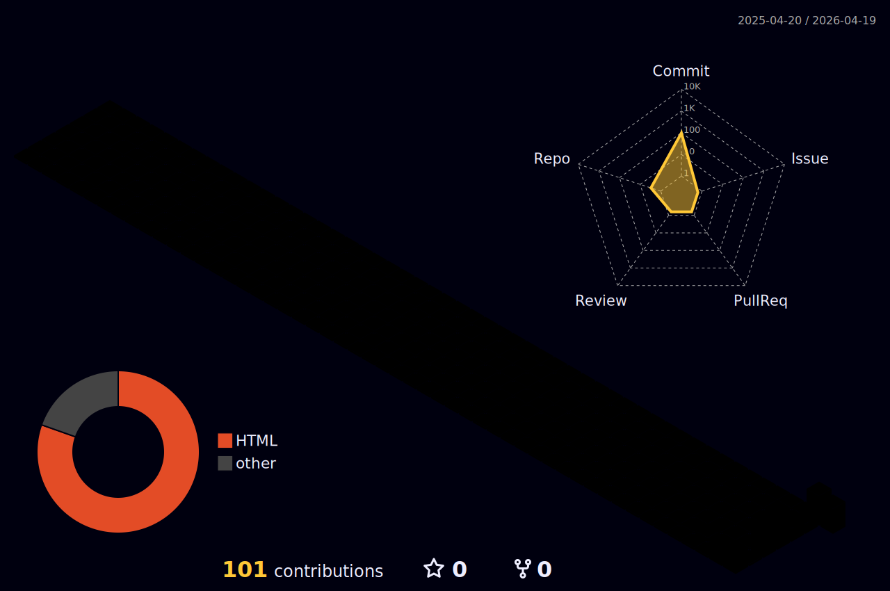

  

  # 🕹️ Press Start: Olá, eu sou João Douglas! 🍄

  *“Transformando tempo e pixels em código.”* ⭐💻

---

## 👾 Player Stats

  

---

## 🧰 Inventário (Tech Stack)

> *As ferramentas equipadas no momento para enfrentar os bosses do dia a dia:*

<h3 align="center">Hotbar</h3>

  
  
  
  
  
  
  
  
  
  
  
  

<h3 align="center">Inventário</h3>

  
  
  
  
  
  
  
  
  
  
  

---

## 🏆 High Scores (GitHub Stats)

  
  &nbsp;
  

---

## 🌈 Cidade Arco-Íris (Activity Graph)

> *Cada commit é uma morada de fada. Veja o que está sendo construído hoje:*

  

---

## 🌐 Multiplayer (Contato)

*Pronto para o modo cooperativo? Me chame aqui:*

  
  

